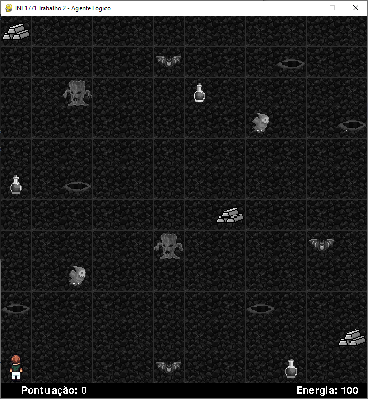
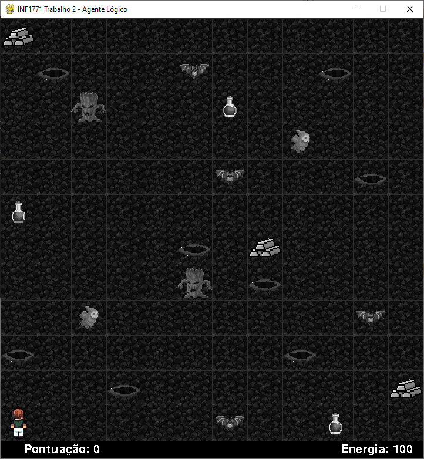
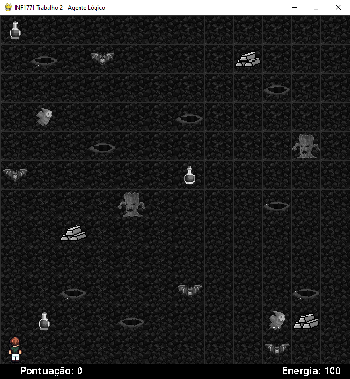

# INF1771_Wumpus_Prolog_Python

Warning - swipl module is currently compatible with swi-prolog 8.4.3 download here  https://www.swi-prolog.org/download/stable/bin/swipl-8.4.3-1.x64.exe.envelope

## Execucao

Por padrao, o programa gera um labirinto aleatorio 12x12 com as quantidades exigidas no enunciado:

- 8 pocos/obstaculos
- 3 ouros
- 3 powerups de energia
- 4 inimigos de teletransporte
- 2 inimigos de dano 50
- 2 inimigos de dano 20

```bash
python gmap.py
```

Tambem e possivel carregar manualmente um mapa pronto:

```bash
python gmap.py mapa_facil.pl
python gmap.py mapa_medio.pl
python gmap.py mapa_dificil.pl
```

A tecla `M` alterna apenas a visualizacao: com `debug = True` mostra o mapa real completo; com `debug = False` mostra a interpretacao do agente. Isso nao altera a tomada de decisao.

## Politica do agente

- O agente so tenta sair pela posicao `[1,1]` depois de pegar os 3 ouros (`ouro_restante(0)`).
- Enquanto ainda houver ouro, a prioridade de exploracao e: qualquer caminho 100% seguro conhecido, inimigo arriscavel quando ha energia para sobreviver a pelo menos um inimigo, morcego apenas quando nao ha inimigo arriscavel, e por ultimo as demais suspeitas.
- Powerups conhecidos sao guardados quando a energia esta alta e buscados quando a energia cai para 80 ou menos, para aproveitar completamente a recuperacao de +20.
- Pocos/obstaculos continuam sendo o maior risco, pois causam morte instantanea. Morcegos sao evitados porque podem teletransportar o agente para um poco.

Mapa Fácil


Mapa Médio


Mapa Difícil

